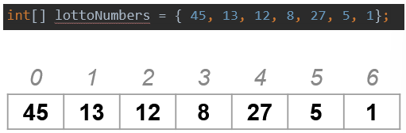
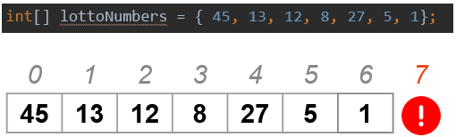

# Arrays und Collections

## Grundsätzliches

Mit den bisherigen Datentypen, die wir kennen, können wir lediglich einzelne Werte in Variablen speichern: Sei es ein Geburtstdatum oder ein Name...

Oft ist es aber notwendig, sich mehrere Werte zu merken: zB eine Bestenliste bei einem Rennen. 

Will man also mehrere Datensätze eines bestimmten Datentyps speichern, braucht man eine sogennante Collection. Eine Collection ist ein Behälter für eine Ansammlung von Daten desselben Datentyps.

Es gibt mehrere Arten von Collections. In diesem Kapitel stellen wir Arrays vor.

## Die wichtigsten Eigenschaften eines Arrays

* **fixe Länge**, die bei der Initialisierung definiert wird
* der Zugriff auf Elemente erfolgt anhand eines Index (Position im Array), so ist die **Reihenfolge der Elemente wichtig**
* das **erste Element** befindet sich immer an der **Position 0** (Index == 0)



## Arrays Java / C#

In höheren Programmierprachen kann ein Array auf folgende Art und Weisen erstellt werden:

### Ein Array aus ganzen Zahlen mit Länge 8

```Java
// Java

int[] intArray = new int[8];
```

```csharp
// C# 

int[] intArray = new int[8];
```

### Ein Array aus Strings mit 3 Elementen: "Hello", "World" und "!"

```Java
// Java

String[] stringArray = {"Hello", "World", "!"};
```

```csharp
// C# 

string[] stringArray = ["Hello", "World", "!"];
```

### Zugriff auf ein Element

Um nun auf ein Element des Arrays zuzugreifen wird der Index verwendet. Wie oben angeführt ist das erste Element an der Position 0. Das Element mit dem Index 3 erhalte ich mit folgender Zeile:

```Java
// Java

int[] intArray = {1,2,3,4,5,6,7,8};
System.out.println(intArray[3]); // Hier wird die Zahl mit dem Index 3 ausgegeben (ACHTUNG! In einem Array ist das erste Element am Index 0!!!), also wird hier die Zahl 4 ausgegeben!
```

```csharp
// C# 

int[] intArray = [1,2,3,4,5,6,7,8];
Console.WriteLine(intArray[3]);
```

ACHTUNG! Wenn man einen Zugriff mit einem Index größer oder gleich der Größe des Arrays versucht wird ein Fehler, eine sogenannte Exception, ausgeworfen, da man versucht, auf ein Element zuzugreifen, das nicht im Array zu finden ist.



### Wert eines Elements ändern

Verändern kann man den Wert auf dieselbe Weise:

#### Java

```Java
// Java

int[] intArray = new int[8];

intArray[0] = 4; // Der Index des ersten Elements ist immer 0!
```

```csharp
// C# 

int[] intArray = new int[8];

intArray[0] = 4; // Der Index des ersten Elements ist immer 0!
```

## 2-Dimensionale Arrays

Ein ***String[]*** ist auch ein Datentyp genauso wie String und int. Da man aus einem String ein Array aus Strings machen kann, kann man auch aus einem String[] ein Array
aus String[] machen.

#### Java

```Java
// Java

String[][] twoDimensionalArray = new String[3][5];
```

```csharp
// C#

string[,] twoDimensionalArray = new string[3,5];
```

Ein 2-Dimensionales Array kann zur Speicherung eines Spielfeldes eingesetzt werden. z.B.: Speichere ein 3x3 Feld aus Zahlen und gib dies auf der Konsole aus.

```Java
// Java

int[][] field = new int[3][3]; // init 3x3 field
for (int i = 0; i < field.length;i++){ // iterate through lines
    for (int j = 0; j < field[i].length; j++){ // iterate through columns of current line
        System.out.print(" " + field[i][j] + " "); // print current column of current line
}
System.out.println(); // line break
}
```

```csharp
// C# 

int[,] field = new int[3,3];
for (int i = 0; i <field.Length;i++){
    for (int j = 0; j < field[i].length; j++){
        Console.Writeline(" " + field[i,j] + " ")
    }
}
```

Zurück zur [Startseite](README.md)