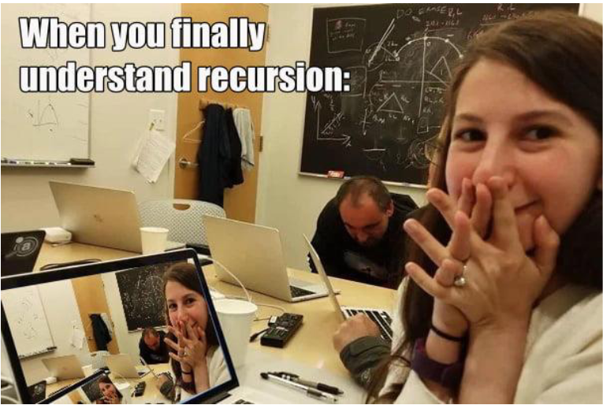
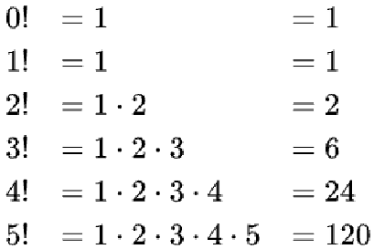
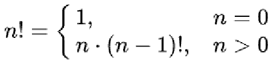
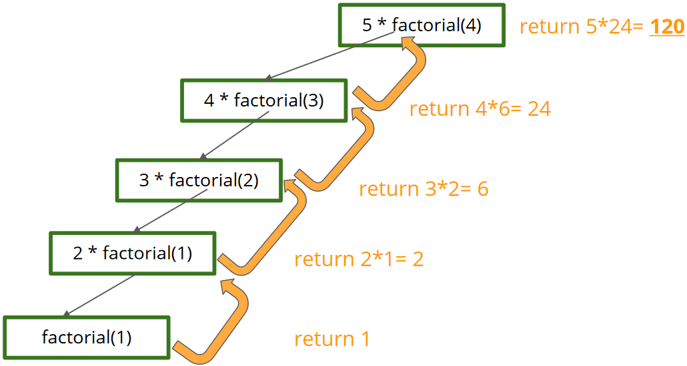
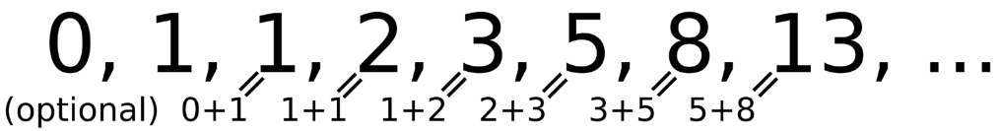

# Rekursion



Dieses Bild stellt dar, wie man in einem Video eine endlose Rekursion: man filmt den Bildschirm, der darstellt, was man gerade filmt... ;-)

## Einführendes Beispiel

Angenommen wir treffen auf einem Spaziergang im Wald eine Fee. Wir haben
das Glück des Lebens getroffen, denn wir haben drei Wünsche frei. Was
würden wir uns wünschen?


Hier kennen wir einen Trick, sicher schon vom Kindergarten :)
Wir wünschen uns beim dritten Wunsch einfach nochmal unsere drei
Wünsche. Angenommen wir wünschen uns zuerst mal einen Ferrari und eine
Luxusvilla, weil wir so bescheiden sind. Wichtigere Angelegenheiten wie etwa
Weltfrieden, können wir uns ja alles noch wünschen, da wir ja mehr als genug
Wünsche zur Verfügung haben ;)

Wenn man dieses Beispiel programmiert, würde es wie folgt aussehen:

### Java

```Java
public static void fulfillThreeWishes() {
    System.out.println(getFerrari());
    System.out.println(getLuxuryVilla());
    fulfillThreeWishes();
}

public static String getFerrari() {
    return "Ferrari";
}

public static String getLuxuryVilla() {
    return "Luxury Villa";
}
```

### C#

```c#

```

Welches Problem besteht hier?

Die Methode ***fulfillThreeWishes()*** ruft sich selbst auf, also endet das Programm nie (bzw. erst wenn der Fehler Stack-Overflow ausgeworfen wird)

## Definition

Als Rekursion (lateinisch recurrere ‚zurücklaufen‘) wird ein prinzipiell unendlicher Vorgang, der sich selbst als Teil enthält oder mithilfe von sich selbst definierbar ist, bezeichnet.

Kurz gesagt ist eine Rekursion eine Funktion, die sich selbst aufruft und sich selbst immer wieder neu definiert.

Üblicherweise sind rekursive Vorgänge relativ kurz beschreibbar bzw.können durch eine relativ kurze Anweisung ausgelöst werden.

## Abbruchbedingung

Der wichtigste Teil der Rekursion ist die Abbruchbedingung. Ohne diese läuft das Programm unendlich, bis die JVM verhindert, dass der Speicher des Rechners voll wird.

Diese muss gut durchdacht sein, um sicherzugehen, dass sie immer eintritt!

## Rekursion als Lösungsstrategie

Rekursion ist auch eine Problemlösungsstrategie. Komplexe Sachverhalte können oft mit rekursiv formulierten Regeln sehr elegant und kurz gelöst werden.

Das Grundprinzip ist dabei dann das Zurückführen einer allgemeinen Aufgabe auf eine einfachere Aufgabe derselben Klasse. Teile-und-herrsche-Strategie (Divide and Conquer)

## Das “klassische” erste Beispiel für Rekursion

Die Fakultät (Faktorielle) ist in der Mathematik eine Funktion, die einer
natürlichen Zahl das Produkt aller natürlichen Zahlen (ohne Null) kleiner und
gleich dieser Zahl zuordnet.



Diese Funktion ist von Natur aus rekursiv, warum?
Man kann die Fakultät von n berechnen, indem man zuerst die Fakultät von (n-1) berechnet. Daher bildet die Berechnung von (n-1)! ein Subproblem, das wir lösen müssen, um n zu berechnen! 

zB. kann 
- 5! durch (4! * 5 ) gelöst werden.
- 4! kann wiederum durch (3! * 4 ) gelöst werden usw.
- dies kann fortgesetzt werden, bis wir bei 0! = 1 landen, was unser Basisfall ist. 

Die formale rekursive Definition lautet:



Programmiert schaut die Implementierung folgendermaßen aus:

### Java

```Java
int factorial(int n) {
    if (n <= 1)                     // Abbruchbedingung
        return 1;
    return n * factorial(n - 1);    // Rekursiver Aufruf mit Änderung des Parameters 
                                    // Wichtig dabei ist, dass das Problem bei jeder Rekursion kleiner wird, damit die Rekursion ein Ende finden kann.
}
```

### C#

```c#

```

## Call Stack

Um Rekursion zu verstehen, ist es wichtig sich bewusst zu machen, wie der Call Stack (Aufrufstapel) funktioniert. Den Stack haben wir als ADS schon kennengelernt.

Hier dient er dazu, den Speicherbereich für Funktionsaufrufe dynamisch zu verwalten. Dieser Speicherbereich kann anwachsen und wieder schrumpfen.

Der Compiler, der diesen Stack verwaltet, legt hier alle Daten ab, die er zur Verwaltung von Funktionsaufrufen benötigt.

Wenn eine Funktion aufgerufen wird, erweitert der Compiler den Stack um einen Datenblock(Stack-Frame). In diesem Datenblock werden die Parameter, die lokalen Variablen und die Rücksprungadresse zur aufrufenden Funktion angelegt. Der Datenblock bleibt so lange bestehen, bis diese Funktion wieder endet. Wird in ihm aber eine weitere Funktion aufgerufen, wird ein weiterer
Datenblock auf den aktuellen gepackt.



## Rekursiv oder Iterativ

Jede Aufgabe, die rekursiv gelöst werden kann, kann auch iterativ gelöst werden. Aber warum lernt  man dann die Rekursivität, wenn man alles iterativ lösen könnte?

### Java

```Java
public static int factorialIterative(int n) {
    int result = 1;
    if (n > 1) { 
        for (int i = 1; i <= n; i++) {
            result = result * i;
        }
    }
    return result;
}
```

### C#

```c#

```

Wie man an der iterativen Lösung der Fakultät erkennen kann, schaut die rekursive Lösung viel einfacher aus und ist auch deutlich kürzer!

## Zurück zu unserem ersten Beispiel mit der Fee

Nun wollen wir versuchen, die Wünsche auf 3 zu begrenzen, d.h. “wieder drei Wünsche” kann man höchstens nur 2 mal wünschen. Im Code machen wir nun folgendes:
- wir geben der wish Methode einen Zähler als Parameter mit
- dieser wird beim nochmaligen Methodenaufruf heruntergezählt
- wenn der Zähler 0 erreicht, wird die Methode beendet

### Java

```Java
public static void main(String[] args) {
    wish(3);
}

static void wish(int n) {
    if (n <= 0) {
        System.out.println("Sorry,you have no more wishes");
        return;
    }
    
    if (n % 2 == 0) {
        System.out.println(getFerrari());
    } else {
        System.out.println(getLuxuryVilla());
    }
    
    wish(n - 1);
}

static String getFerrari() { return "Ferrari"; }
static String getLuxuryVilla() { return "Luxury Villa"; }
```

### C#

```c#

```

## Fibonacci-Folge

Die Fibonacci-Folge ist ein anderer Klassiker für die Rekursion. Sie ist eine
unendliche Folge von Zahlen, bei der sich die jeweils folgende Zahl durch
Addition ihrer beiden vorherigen Zahlen ergibt:



Implementiert sieht die Fibonacci-Folge wie folgt aus:

### Java

```Java
static int fibonacci(int n) {
    if (n == 0) return 0;
    if (n == 1) return 1;
    return fibonacci(n - 1) + fibonacci(n - 2);
}
```

### C#

```c#

```

## Quizfragen:

### Beispiel 1: Was wird bei down1(10) ausgegeben?

#### Java

```Java
static void down1(int n) {
    if (n <=0) { //end of recursion
        return;
    }
    
    System.out.print(n + ", ");
    down1(n-1);
}
```

#### C#

```c#

```

Am besten zeichnest du den Rekursionsbaum und den Callstack, um besser zu verstehen, was dieses Programm genau macht.

### Beispiel 2: Was wird bei down2(10) ausgegeben?

#### Java

```Java
static void down1(int n) {
    if (n <=0) { //end of recursion
        return;
    }
    
    down1(n-1);
    System.out.print(n + ", ");
}
```

#### C#

```c#

```

Am besten zeichnest du den Rekursionsbaum und den Callstack, um besser zu verstehen, was dieses Programm genau macht.

[TODO] Recursion Challenges, Merge Sort, ...